# Reflektion

## Introduktion till min Reflektion

Samtliga ändringar jag gjort på modulen finns i testrapport.md som bilder för att visa vad som är gjort mer konkret. I denna sektion kommer jag att reflektera över ändringarna i modulen (L2), men även koden i L3 kopplat till litteraturen. Varje kapitel 2-11 kommer ha en egen rubrik där jag sammanfattar kapitlet kortfattat, sedan förklarar hur det applicerats/eller inte applicerats på min kod, slutligen visas ett screenshot med ett konkret exempel på hur kunskapen från kapitlet beaktats. **OBS** Jag kommer inte kunna reflektera över alla bitar i varje kapitel men jag väljer ut olika exempel.

## Kapitel 2 - Meaningful Names

#### **Allmänn reflektion**

Detta kapitel behandlar kunskap kring att använda meningsfulla namn i kod, även vikten att de är intentionsavslöjande. Enligt boken Clean Code är det viktigt att funktioner, klasser och variabler faktiskt reflekterar sitt syfta och hur de används i koden på ett tydligt sätt. Det i sin tur leder till att vi behöver förlita oss mindre på kommentarer överallt, och koden i sin helhet blir mer lättförståelig. Kapitlet tar även upp vikten av att inte använda namn som kan vilseleda betraktaren, samt vikten av att namnen ska vara sökbara och undvika exempelvis förkortningar som bara utvecklaren själv förstår.

---

#### **L2 reflektion**

För just detta kapitel tycker jag att **Class Names** är av hög relevans då jag faktiskt ändrade min tidigare kod i modulen på grund av denna regel från boken. De beskriver tydligt att klassnamn ska vara "nouns", inte verb som exempelvis Manager. Därav ändrade jag namn på den klassen till `WeightCollection`. Inte nog med det så ändrade jag även tre metodnamn som faktiskt kunde uppfattas olika beroende på individen, därav ändrade jag namngivning på de för att det skulle bli ännu mer intentions-avslöjande. `addWeight ()` --> `addWeightToCollection ()` för tydlighet. `removeWeight ()` --> `removeWeightFromCollection ()` för tydlighet. `add ()` --> `addWeightsTogether ()` för tydlighet. Namnen blev längre som en konsekvens av detta men jag anser att tydligheten och intentionsavslöjandet väger tyngre.

---

#### **L3 reflektion**

I och med ändringarna i L2 har jag försökt tänka på namngivningen genom hela utvecklingsprocessen och nedan kommer screenshots på tydliga exempel där jag tycker att jag annamat det för att redan nu ha tydliga namn som är relevanta och följer reglerna i Clean Code så väl som möjligt.

Exemplena nedan anser jag till stor del uppfyller Intention-Revealing Names, Avoid Disinformation och Use Pronounceable and searchable names. Min bedömning är att man förstår vad metoden gör utan att se koden, endast på namnet, det är vad det ska vara och är även sökbart och igenkänt.

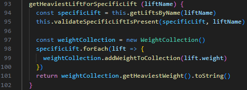

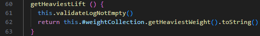

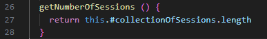

## Kapitel 3 - Functions

#### **Allmänn reflektion**

Kapitel 3 handlar i stora drag om hur funktioner skrivs bäst och vad man ska tänka på kring det. De ska göra en sak, inte vara för stora, ha en konsekvent abstraktionsnivå, samt att funktionerna ska komma som en berättelse nästan i följd. Kapitlet förklarar att argument ska minimeras och istället fokusera på namn som är beskrivande. Kapitlet berör också att funktioner inte ska ha sidoeffekter och i största allmänhet handlar det om hur vi skriver funktioner för att uppnå bättre och renare kod som är lättförståelig.

---

#### **L2 reflektion**

I testrapport.md syns screenshots på vad jag åtgärdat i L2 och just i denna sektionen skulle jag vilja fokusera på **Do One Thing** specifikt för att inte skriva för mycket text här. Jag bröt ut `fromTextInput ()`, `getTotalWeight()` och `getAverageWeight()` i flera mindre funktioner. Detta gjorde jag för att metoderna inte skulle göra flera saker samtidigt och inte ha olika abstraktionsnivå.

- `fromTextInput ()` bröts ut till `validateTextInput ()`, `validateUnitInput ()` och `parseUserInput ()`.

- `getTotalWeight ()` bröts ut till `validateWeightUnit ()`, `addUpAllWeightsInGrams ()` och `convertTotalWeightToWantedUnit ()`.

- `getAverageWeight ()` bröts ut till `calculateTheAverageWeight ()` och `validateCollectionHasWeights ()`.

---

#### **L3 reflektion**

Här är ett exempel på en valideringsmetod jag tycker speglar precis det som kapitel 3 handlar om, att funktioner ska göra en sak, och göra den bra. Bryta ut större funktioner till mindre och så vidare.

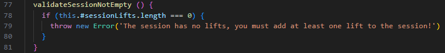

I detta exempel finns både positivt och negativt. Jag vill beröra detta för att påvisa att jag är medveten kring det. Jag tycker den kan få positiv feedback då den gör det som den säger, namngivning är bra och den är relativt lätt att följa enligt mig. Jag tycker också att den är logisk stegvis, att koden faktiskt "berättar en historia". Men även här går att förbättra exempelvis att den gör flera saker även om jag brytit ut vissa saker. Samt att det är olika abstraktionsnivåer från högnivåkoncept till lågnivå. Jag ville ta med detta för att visa bristerna så väl som det goda då jag fortfarande lär mig.

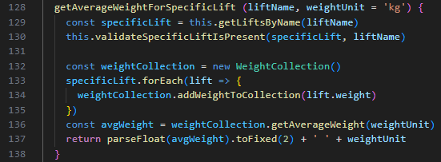

## Kapitel 4 - Comments

#### **Allmänn reflektion**

Kapiteltet berör vikten av kommentarer och förklarar att det är en nödvändighet att använda sig utav det men att det ändå ska användas sparsamt. Jag tolkar boken som att de säger att kommentarer är ett typ av misslyckande då koden i sig själv inte "berättar allt". Jag håller med att fokus borde ligga på att skriva tydlig kod och inte lita fullt ut på att kommentarer ska täcka allt då det i en förlängning blir svårt att hålla kommentarerna uppdatterade. Boken menar att koden är den källan man kan lita på.

---

#### **L2 reflektion och L3**

Jag har använt skolans ESLint vilket innebär att alla funktioner måste ha JSDoc. Jag är väl medveten om att det används för mycket där min kod redan är självförklarande och tydlig nog. Men jag har valt att se det som att jag följer en kodstandard, som att jag arbetade på ett företag, där jag måste följa dessa lintregler och anpassa mig. Så det är positivt i sig, men det blir helt klart överflödigt med kommentarer och med hänvisning till boken bör koden vara tydlig och uttrycksfull för att ersätta överflödiga kommentarer helt enkelt.

---

Här är exempel på hur min JSDoc kan se ut:

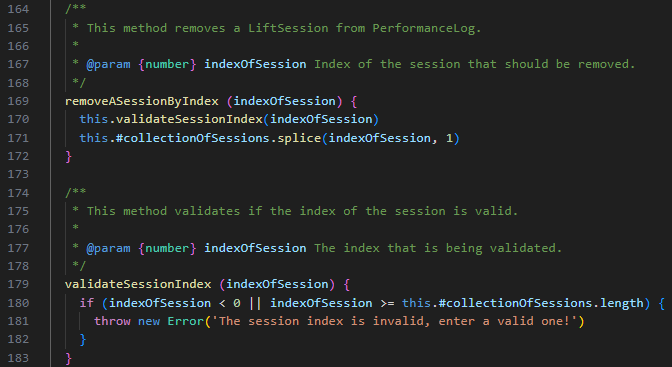

## Kapitel 5 - Formatting

#### **Allmänn reflektion**

Detta kapitel visar och förklarar i både text och kodexempel hur viktigt det är att ha en struktur på sin kod som är läsbar och konsekvent hela tiden. Det handlar om att koden ska kunna vara underhållbar och förståelig dels för teamet men även framtida utvecklare som kommer arbeta i kodbasen. Boken beskriver att team bör ha en kodstandard för formattering så att koden inte är olika i hela kodbasen. Sammanfattningsvis tycker jag kapitlet redogör för hur viktigt det är att koden är förståelig, läsbar och enhetlig, det kan vi inte uppnå utan formattering.

#### **L2 reflektion**

Jag tycker att jag, i min modul, har en bra funktionell uppdelning och att funktioner är tydligt separerade från varandra, att det finns en konsekvent vertikal seperation genom projektet med tomrader, samt horisontell densitet. Jag vet med säkerhet att det kan bli bättre och att jag kan öka läsbarheten men jag är överlag nöjd med hur mitt projekt ser ut och jag tror andra utvecklare skulle finna modulen relativt enkel att läsa av och arbeta i.

---

#### **L3 reflektion**

Eftersom jag använt samma kodstandard och regler i både modulen och appen är min reflektion väldigt lik här. Men jag ser reflektionsdelen av denna uppgiften som ett tillfälle att lära sig, därför skulle jag rikta lite självkritik mot mig själv som jag anser hör hemma till ämnet formattering. Mina metoder har en tendens att ibland bli lite längre än vad de behöver, ibland är det dock svårt och man halvt tvingas till att en metod ska göra flera saker för smidighetens skull i stunden. Ett exempel på detta är `addNewLiftingSession ()`. Jag hade säkerligen kunnat separera denna metoden ut i flera olika istället för bland annat, användarinmatning och validering. Men det handlar dels om kompetensbrist men även tid för min del. Men jag tycker formattering över lag är mycket god i båda mina projekt för att ge positiv feedback! Men jag skulle kunna ha fler tomrader för att öka läsbarheten ytterligare.

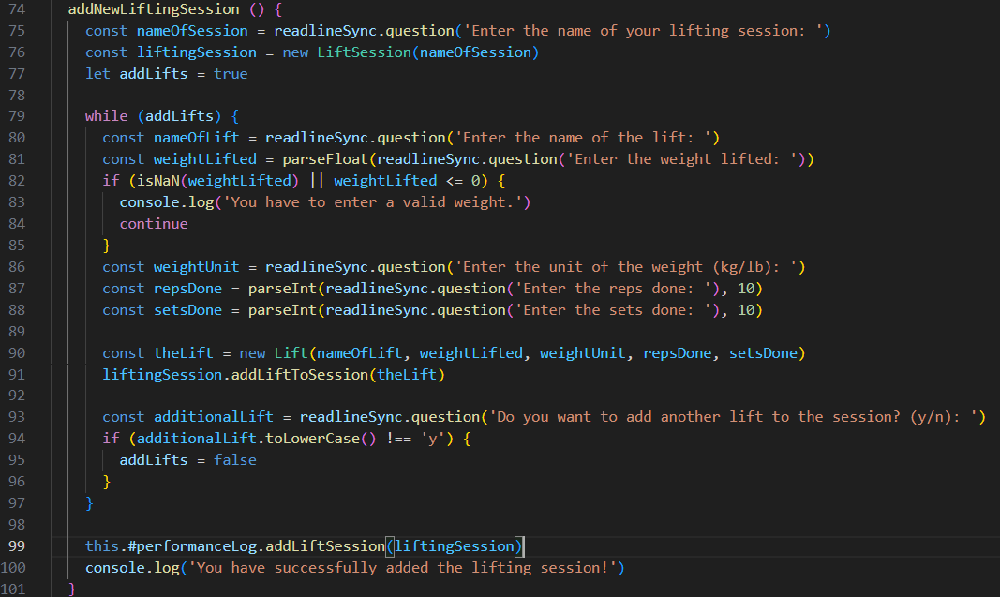

## Kapitel 6 - Objects and Data Structures

#### **Allmänn reflektion**

I detta kapitel talar författaren bland annat om att det är ett vanligt misstag att exponera objekts privata data genom exempelvis getters och setters och att det så kallat "undergräver" abstraktionens syfte. I stort handlar kapitlet om skillnaderna och att objekt döljer data och sedan exponerar detta med hjälp av funktioner/metoder och att datastrukturer exponerar sin. Något som boken tar upp är "The Law of Demeter" som i stort handlar om att objekt inte ska känna till andra objekts inre infromation som de interagerar med och att det finns risk för train-wrecks som de skriver.

---

#### **Reflektioner i min kod**

Jag har försökt, enligt upopgiftens krav, att utveckla mina projekt så pass objektorienterat som jag kan. Jag tycker att det är utmanande med det objektorienterade tankesättet och därför tror jag att jag lätt kan "råka" bryta lite mot principerna. Dock har jag använt privata fält för att dölja dessa och följa det som boken tar om the law of demeter, nedan finns exempel i bilder. Jag har också försökt att använda getters och setters då det är nödvändigt och jag har även fokuserat på att försöka att göra så det inte bryter mot abstraktionerna. Tanken har varit att hämta data utan att exponera den direkt och generellt minimerar hur mycket data jag exponerar. Men jag vet att jag ibland exponerar interna strukturer men det viktiga är att jag tar lärdom av det då objektorienterad programmering är en stor utmaning för mig.

---

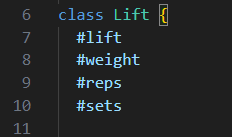

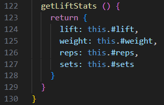

## Kapitel 7 - Error Handling

#### **Allmänn reflektion**

En av alla viktiga delar för att skriva "Clean Code" är just felhantering men det kan vara svårt med felhantering då det lätt kan göra koden svår att läsa. Boken förklarar att det är viktigt att ha en separation mellan själva "huvudlogiken" och felhanteringen för att undvika detta. De tar också upp att felkoder inte är att föredra, utan istället kasta undantag och att dessa undantag ska ge tillräckligt med kontext.

---

#### **L2 reflektion**

Jag refaktorerade L2 en hel del som jag visade med screenshots i testrapporten, en del i det arbetet var att bryta ut metoder i flera metoder, specifikt valideringsmetoder. Då uppfyller jag reglerna ganska väl i Clean Code enligt mig eftersom jag anropar valideringsmetoden inuti de andra metoderna - istället för att ha valideringen direkt i metoden och bryta mot Do One Thing bland annat. Första bilden nedan är ett exempel på min metod fromTextInput som resulterade i tre ytterligare metoder: `validateTextInput ()`, `validateUnitInput ()` och `parseUserInput ()`. Jag är nöjd med den refaktoriseringen och jag tycker ändå att jag till min förmåga uppfyller kapitlet väl med tanke på korrigeringarna. **OBS!** Trots detta positiva har modulen en hel del validering DIREKT i metoderna vilket enkelt hade kunnat ersättas med metodanrop, det är något jag missat och det är inte bra alls. Valideringen måste centraliseras!

---

#### **L3 reflektion**

I och med refaktoriseringen jag gjorde på mina metoder i L2 så försökte jag behålla samma tankesätt i L3. Att jag bryter ut det i flera metoder och anropar de, istället för att ha extremt mycket kod i varje funktion - som dessutom gör flera olika saker, vilket inte är bra. Jag tar med exempel på det nedan också hur jag använt detta.

Något jag tycker är viktigt att nämna är också att Daniel tagit upp att validering i constructorn är en bra grej, jag försökte få med det också och ta till mig den informationen! (Se bild på det nedan med)

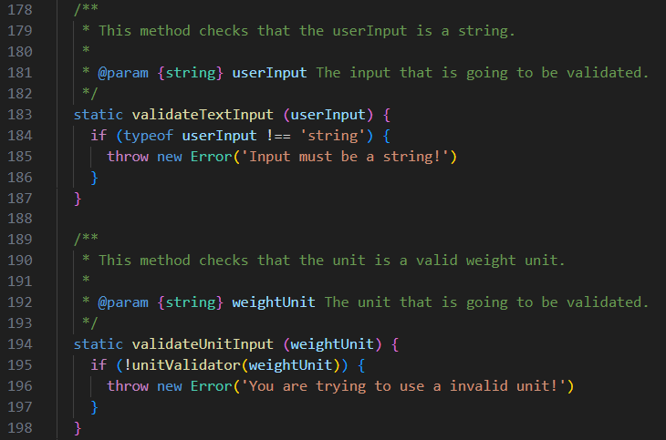

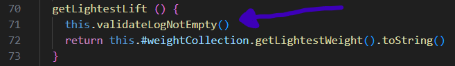

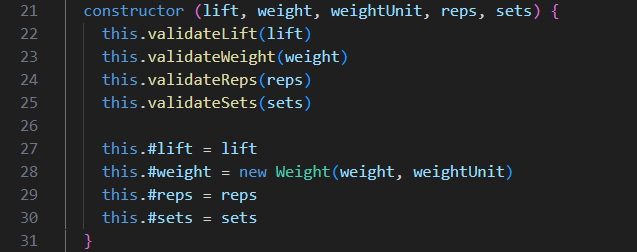

## Kapitel 8 - Boundaries

#### **Allmänn reflektion**

I kapitel 8 om boundaries handlar om hur man ska behandla gränser och gränssnitt mellan tredjepartskomponenter, externa system och sin egen kod bland annat. Det handlar om att man ska minska beroenden och att förändringar som sker i exempelvis andra paket du använder inte ska påverka din kod extremt mycket, utan minska det beroendet. De delar kunskap om detta och att man kan bemöta denna problematik genom att skriva tester för kod som kommer utifrån, men även att man kan isolera just den koden i valda delar. Då kan man i alla fall bättre hantera problematiken som kan uppstå utan att det påverkar hela applikationen på ett mycket negativt sätt.

---

#### **L2 & L3 reflektion**

Om jag tolkar denna del rätt så tycker jag ändå att jag gjort ett relativt bra jobb med att skapa mina egna abstraktioner som jag ser som ett "lager" mellan modulen och min app. Jag skulle dock helt klart kunna förbättra detta genom ytterligare inkapsling för just nu anropar jag exempelvids WeightCollection i PerformanceLog och jag skulle möjligen kunna minska detta beroendet om jag hade skapat en mer abstrakt "representation" av den klassen istället, jag tänker att det potentiellt skulle kunna minska beorendet något. Boken tar också upp "Learning Tests" och det känner jag väl inte att jag implementerat, men det är helt klart en förbättringsåtgärd för att vid tredjepartskod så kan vi se om den beter sig annorlunda när en uppdatering sker av just det paketet, bra att använda sig av i framtiden, speciellt när flera paket är inblandade känner jag.

---

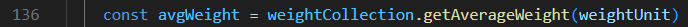

## Kapitel 9 - Unit Tests

#### **Allmänn reflektion**

I boken förklarar författaren att det är viktigt att man inte bara håller sin "production-code" ren, utan även testkoden ska vara på samma nivå och är lika viktig. De tar upp olika principer där den jag är mest intresserad av är "Test Driven Development" då jag hört från bekanta att många bolag arbetar med det tillvägegångssättet. Det handlar kort om att man skriver sina tester innan man skriver den faktiska koden och processen som jag förstått kan vara att man tar fram kraven tydligt tidigt, sedan utformar tester utefter det och sedan bygger vidare med faktisk produktionskod. I det stora förklarar de att det är viktigt att testkoden är uttrycksfull, enkel att förstå och att den har hög läsbarhet. De beskriver också vikten av att testkoden ska vara självvaliderande, snabb och oberoende för att de ska vara enkla att underhålla helt enkelt. Bra testkod leder också till en bättre produktionskod.

---

#### **L2 reflektion**

Trots att man är rookie så tycker jag en positiv aspekt i mina tester är delar utifrån det boken säger om F.I.R.S.T att jag tycker mina tester är relativt tydliga och att de checkar ett visst beteende i testet (expect t ex). De validerar också sig själva som de nämner i boken "Self-Validating" att de meddelar ifall det gått bra eller inte helt enkelt. Negativa delar dock är att jag upplever min testkod som repetativ, alltså lite brytande mot DRY om nu denna kod ska vara lika ren som produktionskoden. Jag är inte helt säker på om eller hur detta kan lösas, men jag tror inte mina automatiska tester är optimala när jag kollar varje enhet och så vidare, det är många väldigt liknande tester som tar många rader kod. Får kika vidare på det. Efter att ha läst kapitlet kan jag också i framtiden beakta "Domain-Specific Testing Language", kände inte till detta alls innan men det hade säkerligen ökat läsbarheten i min testkod som de beskriver i boken är en av fördelarna.

---

#### **L3 reflektion**

Jag tycker väl egentligen det är samma reflektion här, automatiska tester är något nytt för mig men jag tycker väl de är enkla att förstå och att jag testar det mesta som går. Men samma kritik som ovan går att ge på testerna i L3 med.

---

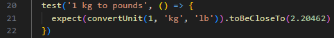

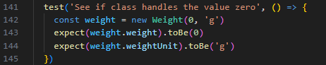

## Kapitel 10 - Classes

#### **Allmänn reflektion**

Detta kapitel redogör att det är viktigt att klasser ska vara små och ha ett specifikt ansvar, precis som boken säger om funktioner. Författarna förklarar hur viktigt deet är att fokusera på just klassdesign för att organisera kod på en "högre" nivå. Bra klasser menar de leder till en mer underhållbar kod som dessutom är mycket renare, det uppnås genom bland annat tydlig separation mellan privata och publika metoder, men även sammanhållning mellan instance variables och metoder. I kapitlet tar de även upp OCP och SRP som principer för att strukturera klasser för att underhållbarheten b.l.a ska vara god.

---

#### **L2 reflektion**

Jag tycker ändå jag lyckats bra med SRP i båda klasserna för modulen. De har varsett fokus på vad just de ska göra. Validering är bra då jag fångar dessa tidigt i Weight-klassen till exempel men de är inte egna metoder i min nuvarande lösning på modulen. En negativ aspekt gällande de är också att det blir lite duplicering med mina valideringar. Jag tycker även jag kan bryta ut i ännu fler metoder för att hålla mig till bokens regler om DRY, jag hade kunnat implementera en hjälpfunktion till mina metoder för att undvika dupliceringen som är just nu. Samma sak med valideringen i dessa metoder, ett exempel finns nedan i bild. Valideringen måste centraliseras MYCKET bättre.

---

#### **L3 reflektion**

Tycker ändå L3 är bra med just SRP, jag använder privata fält till min förmåga för att arbeta med inkapsling och valideringen har jag försökt bryta ut i metoder för att undvika duplicering. Tycker dock även här att man kan samla alla dessa valideringsmetoder och slippa duplicering ytterliggare genom att ha en gemensam valideringslösning så här i efterhand. Menu-klassen tycker jag har lite långa metoder så klart, det kan brytas ut mycket mer än vad det är men jag tror att jag blundade lite för det eftersom det är så mycket utskrifter och det var i slutskedet av min apps utveckling. Men definitivt något som kan förbättras. Jag tror den gemensamma nämnaren kan vara att försöka minska dupliceringen av kod på många olika sätt, rookie som man är!

---

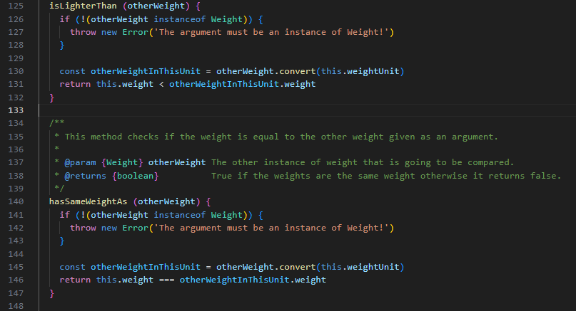

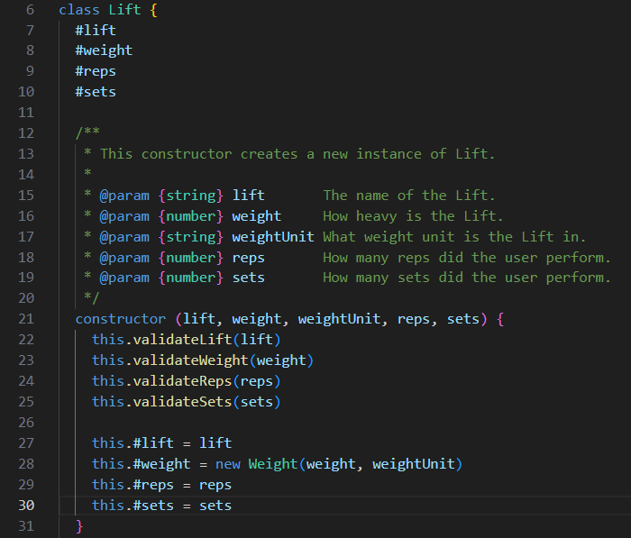

## Kapitel 11 - Systems

#### **Allmänn reflektion**

Det stora jag tar med från detta kapitlet är att så länge ett system är välorganiserat så kan det växa inkrementellt, samt att arkitekturer i system ska, kan och bör utvecklas och även faktoreras. De förklarar också att det är viktigt att separera användningen från konstruktionen så att det går att vidareutveckla en del utan att förstöra eller påverka en annan del. De gör liknelsen med en stad att modulära och decentraliserade system underlättar för systemet att skalas upp och underhållas. Kapitlet tar även upp exempelvis "Dependency Injection".

---

#### **Reflektion på min kod:**

Jag har varit inne på det innan men jag tycker att mina klasser ändå har ett uppdelat ansvar, jag har försökt skapa en klass för varje syfte som måste uppnås i min kod. Jag tycker ändå de är relativt avskilda från varandra i syfte och innehåll. Jag har försökt tänka på det boken tar upp om modulariseing och att klasserna har sitt egna ansvar och sedan skapa en testfil för varje klass. Då kan jag, enligt mig själv, jobba vidare i en del av koden utan att förstöra annan del eller behöva åtgärda för mycket. Detta har i alla fall varit tanken även om det inte är optimalt utfört. Dock i efterhand när man dyker djupare i litteraturen ännu en gång så kan Dependency Injection varit ett mönster jag skulle använt, exempelvis då att WeightCollection inte ska instansieras direkt i klasser utan då möjligen injectas, bara en tanke som slått mig i efterhand. Se bild nedan.

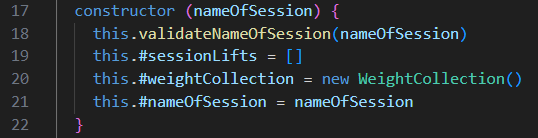
