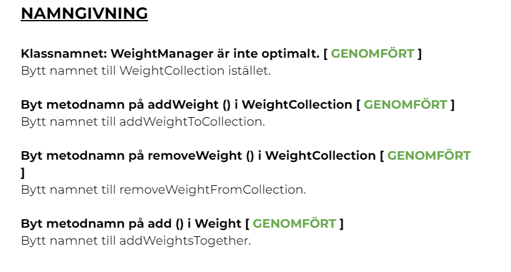
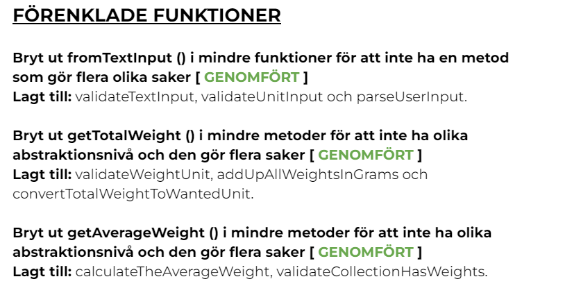
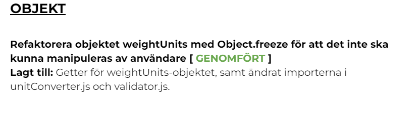

# Testrapport

## Introduktion

I detta dokument kommer jag att redovisa mina ändringar jag gjort på modulen (L2), samt manuella tester för Menu.js-klassen, sedan även coverage för de automatiska tester för resterande klasser skrivna med Jest. OBS! Reflektioner kring kapitel ur Clean Code och reflektion kring denna appens, samt ändringar i modulen (L2) återfinns i reflektionsdokumentet.

## Förändringar på Modulen L2

Jag valde att sammanställa den feedback jag fick av min review-partner, samt åtgärda mina egna reflektioner jag skrev om i modulen (L2). Jag gjorde en lista och betade av den steg för steg. På grund av tidsbrist så bedömde jag att det var dessa delar av modulen jag hade tid att korrigera, det var också de delarna jag bedömde som mest kritiska att åtgärda. Mina ändringar berör områdena: "NAMNGIVNING", "FUNKTIONER" och "OBJEKT".

Här presenteras en bild av mina genomförda aktiviteter vad gäller korrigeringar på modulen (L2):

## Manuella tester för Menu.js
