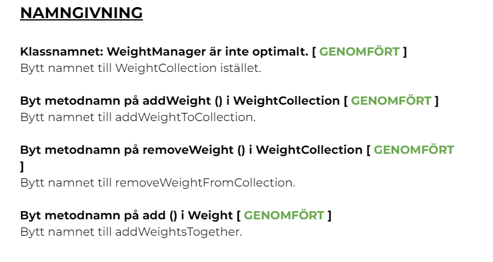
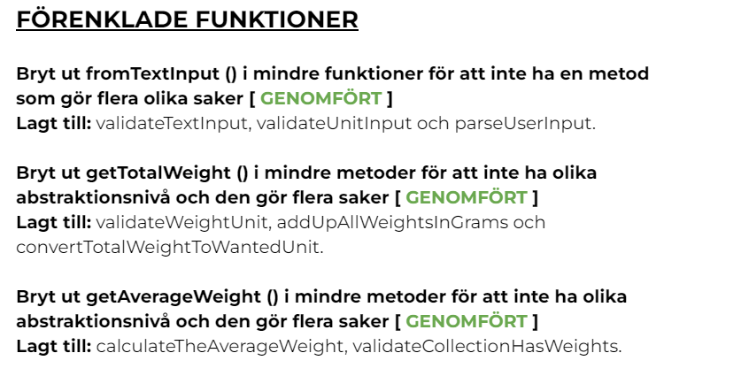
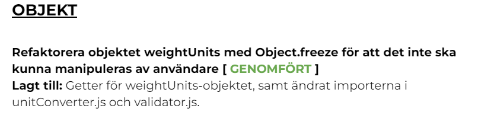
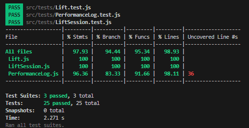

# Testrapport

## Introduktion

I detta dokument kommer jag att redovisa mina ändringar jag gjort på modulen (L2), coverage för de automatiska tester för resterande klasser skrivna med Jest, samt manuella tester för Menu-klassen. **OBS!** Reflektioner kring kapitel ur Clean Code och reflektion kring denna appens, samt ändringar i modulen (L2) återfinns i reflektionsdokumentet.

## Förändringar på Modulen L2

Jag valde att sammanställa den feedback jag fick av min review-partner, samt åtgärda mina egna reflektioner jag skrev om i modulen (L2). Jag gjorde en lista och betade av den steg för steg. På grund av tidsbrist så bedömde jag att det var dessa delar av modulen jag hade tid att korrigera, det var också de delarna jag bedömde som mest kritiska att åtgärda. Mina ändringar berör områdena: "NAMNGIVNING", "FUNKTIONER" och "OBJEKT".

Här presenteras en bild av mina genomförda aktiviteter vad gäller korrigeringar på modulen (L2):





## Coverage för automatiska tester

Denna coverage avser samtliga klasser utom "Menu.js".



## Manuella tester för Menu.js

Genomför samtliga tester i följd, efter varandra för att korrekt kunna testa hela applikationen.

## Tabell över manuella tester

| **Test** | **Vad testas?**                           | **Förväntat resultat/Output**                                | **Godkänt/Icke-godkänt** |
| -------- | ----------------------------------------- | ------------------------------------------------------------ | ------------------------ |
| Test 1   | Starta applikationen                      | Applikationen startar och visar huvudmenyn                   | Godkänt                  |
| Test 2   | Lägg till en ny lifting session           | Användaren kan lägga till en lifting session                 | Godkänt                  |
| Test 3   | Visa registrerade lifting sessions        | Applikationen visar alla registrerade lifting sessions       | Godkänt                  |
| Test 4   | Visa personlig statistik                  | Applikationen visar statistik                                | Godkänt                  |
| Test 5   | Lägg till flera övningar och se statistik | Applikationen visar statistik på flera övningar              | Godkänt                  |
| Test 6   | Radera en lifting session                 | Användaren kan radera/ta bort en registrerad lifting session | Godkänt                  |
| Test 7   | Avsluta applikationen                     | Applikationen avslutas                                       | Godkänt                  |

Nedan följer instruktioner för vardera test som kontrollerats i tabellen ovan.

## Test 1 - Starta applikationen

Målet med detta test är att applikationen går att starta och att användaren presenteras med huvudmenyn.

1. Öppna terminalen i Visual Studio Code.
2. Starta applikationen med kommandot:
   `node src/main.js`

**Förväntat resultat/Output**
Applikationen ska nu ha skrivit ut följande i terminalen:

```
Hello, Welcome to "Alexander Strength Lifting Tool"!

Main Menu:
1. Add new lifting session
2. View your stats
3. View all lifting sessions
4. Remove a lifting session
5. Quit the app
Choose one of the following (1-5):
```

## Test 2 - Lägg till en ny lifting session i applikationen

Målet med detta test är att användaren ska kunna lägga till en ny lifting session framgångsrikt.

1. Välj alternativ 1 i huvudmenyn.

**Din input**
Efter att ha valt alternativ 1, kommer applikationen be dig om information för att skapa en ny lifting session. Använd följande input-data för de olika frågeställningarna:

```
Enter the name of your lifting session: Chest Session
Enter the name of the lift: Incline Bench
Enter the weight lifted: 90
Enter the unit of the weight (kg/lbs): kg
Enter the reps done: 8
Enter the sets done: 4
Do you want to add another lift to the session? (y/n): n
```

**Förväntat resultat/Output**
Efter du valt "n" på sista frågeställningen ska applikationen skriva ut:

```
You have successfully added the lifting session!
```

## Test 3 - Visa dina registrerade lifting sessions

1. Välj alternativ 3 i huvudmenyn.

**Förväntat resultat/Output**
Applikationen ska skriva ut dina registrerade lifting sessions. Specifikt det som skapades i Test 2.

```
All of your lifting sessions:
1. Chest Session
```

## Test 4 - Visa din personliga statistik för lyft

1. Välj alternativ 2 i huvudmenyn.

**Förväntat resultat/Output**
Applikationen ska skriva ut flera 6 olika alternativ för att visa användaren statistik. Det ska presenteras som följande:

```
Your performance stats:
1. The heaviest lift out of all lifts
2. The lightest lift out of all lifts
3. The average weight out of all lifts
4. The heaviest lift of a specific lift
5. The lightest lift of a specific lift
6. The average weight of a specific lift
Choose one of the following (1-6):
```

Välj alternativ 1.

**Förväntat resultat/Output**

The heaviest lift out of all lifts is: 100 kg

## Test 5 - Lägg till flera olika övningar i en lifting session och kontrollera statistik

1. Välj alternativ 1 i huvudmenyn.

**Din input**
Efter att ha valt alternativ 1, kommer applikationen be dig om information för att skapa en ny lifting session. Använd följande input-data för de olika frågeställningarna:

```
Enter the name of your lifting session: Chest Session
Enter the name of the lift: Incline Bench
Enter the weight lifted: 90
Enter the unit of the weight (kg/lbs): kg
Enter the reps done: 8
Enter the sets done: 4
Do you want to add another lift to the session? (y/n): y
```

När du svarat "y" frågar applikationen efter följande information i följd igen, fyll i enligt uppgifterna nedan:

```
Enter the name of the lift: Pecken
Enter the weight lifted: 40
Enter the unit of the weight (kg/lbs): kg
Enter the reps done: 12
Enter the sets done: 3
Do you want to add another lift to the session? (y/n): n
```

Apllikationen ska nu visa huvudmenyn igen och du väljer Alternativ 2 "View your stats". Kontrollera att du får följande output vid valt alternativ:

Alternativ 1: The heaviest lift out of all lifts is: 90 kg

Alternativ 2: The lightest lift out of all lifts is: 40 kg

Alternativ 3: The average weight out of all lifts is: 73.33 kg

Alternativ 4: Ber dig skriva in namnet på valt lyft, välj "Pecken". Applikationen ska då skriva ut: The heaviest lift of Pecken is: 40 kg

Alternativ 5: Ber dig skriva in namnet på valt lyft, välj "Pecken". Applikationen ska då skriva ut: The lightest lift of Pecken is: 40 kg

Alternativ 6: Ber dig skriva in namnet på valt lyft, välj "Pecken". Applikationen ska då skriva ut: The average weight of Pecken is: 40.00 kg

## Test 6 - Radera en lifting session

1. Välj alternativ 4 i huvudmenyn.

**Förväntat resultat/Output**
Applikationen ska nu skriva ut följande till dig:

```
Which session would you like to remove?
1. Chest Session
Enter the number of the session you want to remove:
```

**Input**
Välj alternativ 1.

**Förväntat resultat/Output**
Applikationen ska nu skriva ut The session has been successfully removed.

**Avslutande test**
Vid val av alternativ 2, 3 eller 4 i huvudmenyn ska applikationen skriva ut: You have no lifting sessions, you must add at least one!

## Test 7 - Avsluta applikationen

1. Starta applikationen med kommandot:
   `node src/main.js`

**Förväntat resultat/Output**
Applikationen ska nu ha skrivit ut följande i terminalen:

```
Hello, Welcome to "Alexander Strength Lifting Tool"!

Main Menu:
1. Add new lifting session
2. View your stats
3. View all lifting sessions
4. Remove a lifting session
5. Quit the app
Choose one of the following (1-5):
```

1. Välj alternativ 5 i huvudmenyn.

**Förväntat resultat/Output**

```
Quitting the app...
```

Applikationen ska nu vara stängd.
